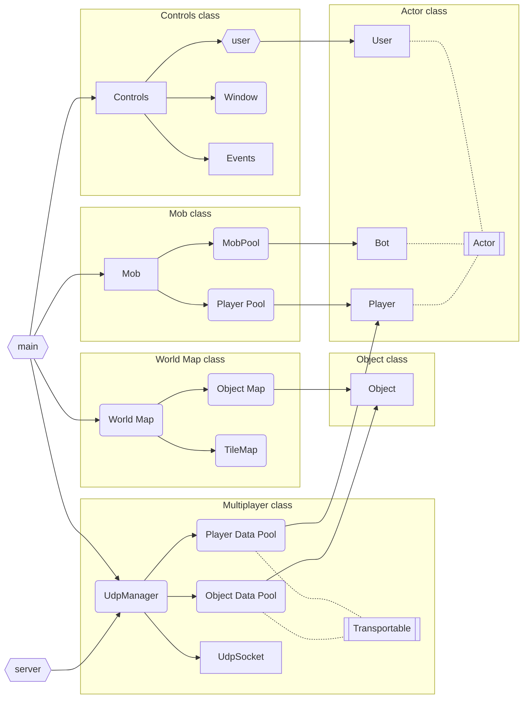

# SFML_project

Multiplatform minigame that demonstrates SFML library potential.

## Configuring

In file `include/Constants.hpp` you can set pixel and window size up. Keep in mind that real window size is `window size` * `pixel size`.

## Installation

### Linux

- install dependencies:

```bash
sudo apt-get update && sudo apt-get install libxrandr-dev libxcursor-dev libudev-dev libopenal-dev libflac-dev libvorbis-dev libgl1-mesa-dev libegl1-mesa-dev libdrm-dev libgbm-dev
```

- intall SFML (if it's not yet):

```bash
git clone https://github.com/SFML/SFML.git && cd SFML && git checkout 2.6.x && cd ..
cmake -S SFML -B SFML/build -DCMAKE_INSTALL_PREFIX=SFML/install -DBUILD_SHARED_LIBS=FALSE
cmake --build SFML/build --config Release --target install
```

- install the game:

```bash
cmake -B build -DCMAKE_INSTALL_PREFIX=install -DSFML_DIR=SFML/install/lib/cmake/SFML -DBUILD_SHARED_LIBS=FALSE
cmake --build build --config Release --target install
```

## Running

`bin` directory will consist all binaries and textures:

- `SFML_project` - game client executable

    You can use `w`, `a`, `s` and `d` buttons for moving across the map.

- `server` - game server executable
- `textures` - dir with all textures

## Architecture


