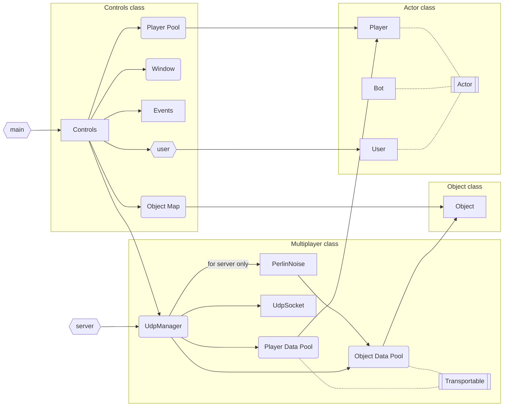

# SFML_project

Multiplatform minigame that demonstrates SFML library potential.


## Configuring

In file `textures/constants.txt` you can set up the game settings: server ip, ports, pixel size, VSYNC, framerate limit, etc.

## Installation

### Linux

- install dependencies:

```bash
apt install libxrandr-dev libxcursor-dev libudev-dev libopenal-dev libflac-dev libvorbis-dev libgl1-mesa-dev libegl1-mesa-dev libdrm-dev libgbm-dev
```

- build the game:

```bash
cmake -B build
cmake --build build --target install
```

## Running

`build/bin` directory will consist all binaries and textures:

- `SFML_project` - game client executable

    - `w`, `a`, `s` and `d` buttons for moving across the map,
    - `Tab` button for opening inventory.

- `server` - game server executable
- `textures` - dir with all textures and configuration files

### About server and multiplayer

Server sends all the information about terrain, objects around and player's inventory to each client.

At the moment, player can't connect to the global server defined in settings file without being in the same local network. So, player has 2 options:

- message me in Telegram and ask OpenVPN configuration file for globally deployed server
- run `server` on a dedicated device in the same local network you want to play in

## Architecture


